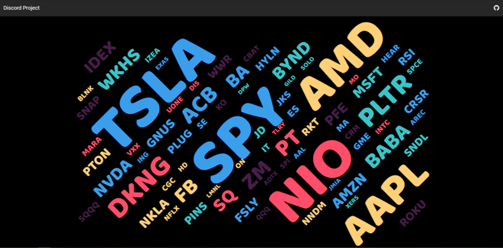

# Retail Sentiment Trading Application
> An Equity Trading and Allocation Program based on Retail Investor Sentiment

## Description

> 2021 was the year of the retail trader. The launch of long languishing stocks such as GameStop and AMC into new valuation stratospheres through the collective action of individual investors and the subsequent reaction of institutional brokers brought the stock market back into the center of American culture in a way not seen since the 2008 subprime mortgage crisis. The power of retail investors and day traders has made Elon Musk the richest person on the planet, extended the life of fledgling businesses and shattered the impervious veneer of hedge fund managers across Wall Street. Still, the main questions left in the wake of these events has to be why the financial industry and the financial news media in particular was caught so off-guard by these actions and how can future trading applications account for the retail investor sentiment?

>  The goal of this project is to develop a trading program that answers the latter question through Sentiment Analysis. Comments and postings of retail traders in private Discord chatrooms will be collected, cleaned, analyzed, and transformed into sentiment scores that will be fed to a custom trading algorithm in order to create a balanced portfolio based on the interest and mood of retail investors. The success and validity of these trading strategies will be compared to trading strategies that rely solely on institutional information sources. The institutional sources for this project will be (1) financial news on public companies from Investing.com and Seeking Alpha and (2) analyst recommendations from investment banks and investment research institutions. The final product is a custom web application built on Vue.js that showcases the sentiment and wording structure of the separate data sources and visualizes the returns on a portfolio through each trading strategy.   

## Getting Started 

For a walkthrough on the dataset and an analysis of the text-based and sentiment features, <a src="https://discord-traders.herokuapp.com">please visit my analysis page here.</a>
Here, I explore the insights gained from each individual source of data through a series of diverse visualizations. 

To jump straight to trading, <a src="https://discord-traders.herokuapp.com/trading_application/">please visit my application page here.</a>
The interactive app allows you to create custom trading strategies based on the project data and evaluate their performance against the market, GICS sector ETFs, Bitcoin, and other trading strategies. The starting trading strategy is based off of the sentiment and mention frequency of Discord comments.

### Toolset
* Languages: Python, JavaScript, HTML5, CSS3, SQL
* Frameworks: Flask, Vue.js
* NLP and Text Processing: Emosent, Emoji, NLTK, VaderSentiment
* Data Collection: PyAutoGUI, BeautifulSoup4, Selenium, Yahoo Finance API
* Data Storage and Querying: SQLAlchemy, Pandas
* Visualization: Vue.js, Vuetify.js, VueSVG.js, VueWordCloud.js, JQuery.js, ApexCharts.js, Chart.js, Animate.js, D3.js  

### Authors
Kyle Lewis – kylel9815@gmail.com

### Version History
* 1.0.1
    * Deployed to Heroku
    * Released Interactive Trading Program
    * Released Visualization and Analysis PAge

## Acknowledgments

Project Organization
------------

    ├── LICENSE
    ├── Makefile           <- Makefile with commands like `make data` or `make train`
    ├── README.md          <- The top-level README for developers using this project.
    ├── data
    │   ├── external       <- Data from third party sources.
    │   ├── interim        <- Intermediate data that has been transformed.
    │   ├── processed      <- The final, canonical data sets for modeling.
    │   └── raw            <- The original, immutable data dump.
    │
    ├── docs               <- A default Sphinx project; see sphinx-doc.org for details
    │
    ├── models             <- Trained and serialized models, model predictions, or model summaries
    │
    ├── notebooks          <- Jupyter notebooks. Naming convention is a number (for ordering),
    │                         the creator's initials, and a short `-` delimited description, e.g.
    │                         `1.0-jqp-initial-data-exploration`.
    │
    ├── references         <- Data dictionaries, manuals, and all other explanatory materials.
    │
    ├── reports            <- Generated analysis as HTML, PDF, LaTeX, etc.
    │   └── figures        <- Generated graphics and figures to be used in reporting
    │
    ├── requirements.txt   <- The requirements file for reproducing the analysis environment, e.g.
    │                         generated with `pip freeze > requirements.txt`
    │
    ├── setup.py           <- makes project pip installable (pip install -e .) so src can be imported
    ├── src                <- Source code for use in this project.
    │   ├── __init__.py    <- Makes src a Python module
    │   │
    │   ├── data           <- Scripts to download or generate data
    │   │   └── make_dataset.py
    │   │
    │   ├── features       <- Scripts to turn raw data into features for modeling
    │   │   └── build_features.py
    │   │
    │   ├── models         <- Scripts to train models and then use trained models to make
    │   │   │                 predictions
    │   │   ├── predict_model.py
    │   │   └── train_model.py
    │   ├── scripts        <- Scripts for data acquisition
    │   │   │           
    │   │   └── Discord-Scraper
    │   │        ├── SimpleRequests          <- 
    │   │        │     │ 
    │   │              └──
    │   │  
    │   ├── predict_model.py
    │   └── visualization  <- Scripts to create exploratory and results oriented visualizations
    │       └── visualize.py
    │
    └── tox.ini            <- tox file with settings for running tox; see tox.readthedocs.io

--------

<small>Project based on the <a target="_blank" href="https://drivendata.github.io/cookiecutter-data-science/">cookiecutter data science project template</a>. #cookiecutterdatascience</small>

